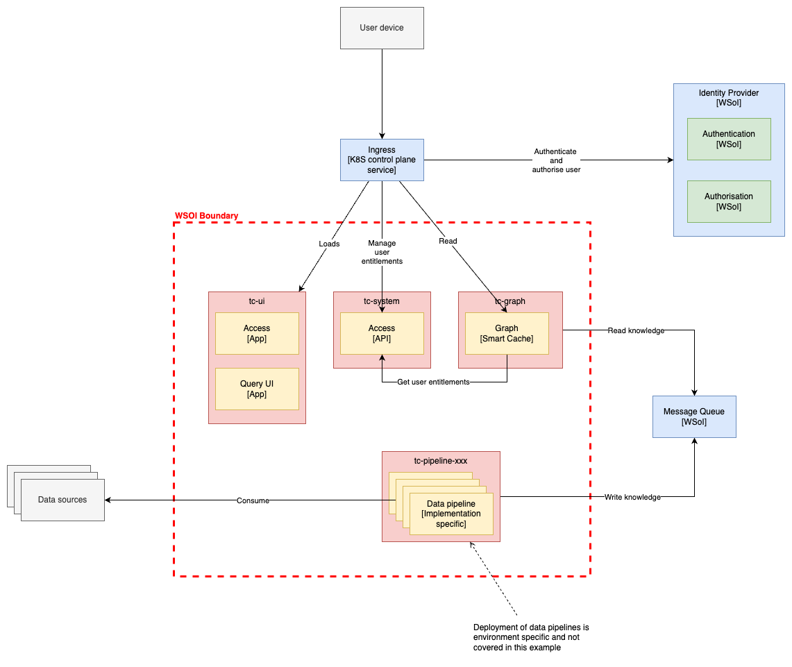

# Deployment design

This section describes the deployment design in technology independent terms
(within pragmatic limits).

## Structure of the deployment design

This section describes the internals of the logical design in terms of
components and the communications between them. Selected elements of the WSoI
have been included to aid understanding.

The purpose is to provide a high level
understanding of the function of system sufficient to evaluate aspects of its
deployment in a specific environment. It is not intended as comprehensive system
or software architecture.

The diagram below illustrates the logical deployment design. Components are
grouped loosely by common purpose or goal (`tc-system`, `tc-graph` etc.).

### Application UI (`tc-ui`)

These components host the various single page web applications that compose the
Telicent UI. These are loaded into the user's device (web browser) and provide
the interface between the user and the Telicent APIs.

### Smart cache graph (`tc-graph`)

These components implement all functionality associated with the graph based
view of the knowledge topic.

### System components (`tc-system`)

These components provide integrations with a wider system of interest.

### Data pipelines (`tc-pipeline-xxx`)

These components derive knowledge from the datasources and publish this to the
message queue. Each logical pipeline is deployed separately.

Note this example does not explain how data pipelines are developed or deployed. A data smoke test is provided to prove the deployment.