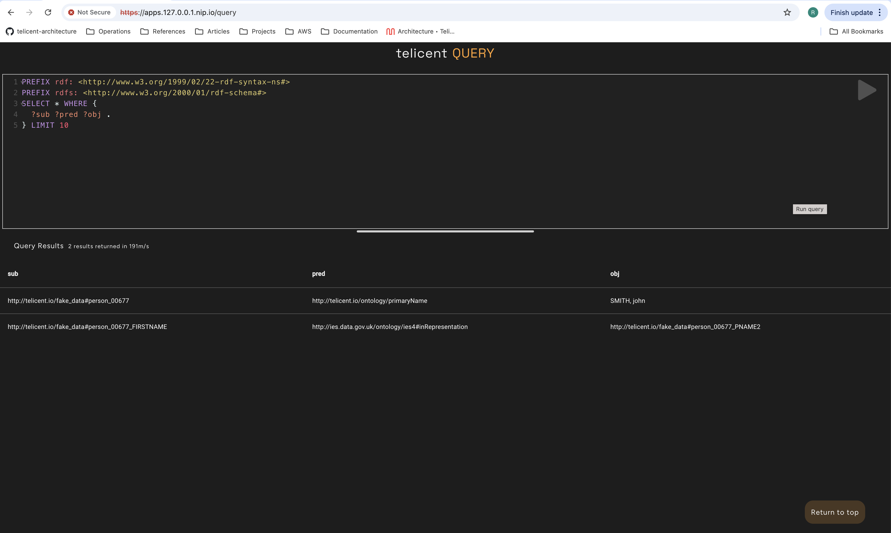

# Smoke test

This step add a small amount of data to the system and then walks through first
login and query.

## Add the test data

The data is added by a Kubernetes job that injects knowledge messages directly
into Kafka from a config map. Note this is not a recommended practice but
sufficient to prove the system.

### Adjust the Kafka brokers value

[Source](../../utils/smoke-test/kustomization.yaml)

Update the patch to the appropriate value

### Review and apply resources to the cluster

Review the resources that will be created:

```
kubectl kustomize utils/smoke-test
```

Create the Query UI component:

```
kubectl apply -k utils/smoke-test
```

### Check deployment status

Check the status of the job

```
$ kubectl get job,pod -n default
NAME                       COMPLETIONS   DURATION   AGE
job.batch/load-test-data   1/1           5s         15s

NAME                       READY   STATUS      RESTARTS   AGE
pod/load-test-data-8d8qt   0/1     Completed   0          15s
```

Inspect the logs to see if SCG ingested the data. Look for a line similar to:

```
11:30:46 INFO  FusekiKafka     :: [knowledge] Batch: Start offset = 0 ; Count = 1 : Payload = 262 bytes
11:30:46 INFO  FusekiKafka     :: [knowledge] Batch: Finished [0, 1] in 0.257 seconds
```

### Remove the job and config map

The job (but not the data in Kafka) can be removed like so:

```
kubectl delete -k utils/smoke-test
```

## Query the data

Ensure you have the credentials for a user with the `tc_admin` group claim.

### First log in

In your browser navigate the the QueryUI:

```
https://$TELICENT_HOST/query
```

Authenticate as determined by the Istio OIDC configuration.

On first login your user will be created in Telicent Access but it will not be
active. You will receive a message like this:


### Enable your user

To enable your user first navigate to the Access UI:

```
https://$TELICENT_HOST/access
```

Find the user in the UI and click on the pencil icon on the right hand side:


Enter the user's organisation, toggle the active switch, then press update.


Note anyone with `tc_admin` can do this for any other subsequent user.

### Query the data

Return to the Query application:

```
https://$TELICENT_HOST/query
```

The Query UI should now display:


Press the go button (triangle top right). The query should return two results.


