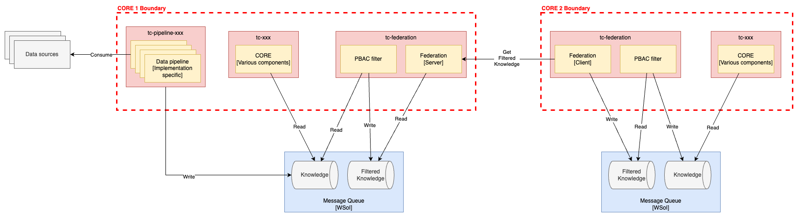

# Deployment design

> Note this functionality is in beta. It will share all knowledge from the
> server CORE with the client CORE. Future releases will address filtering the
> knowledge to be sent from the server CORE to the client CORE.

## Structure of the deployment design

The diagram below illustrates the logical design of the deployment.

The client and server COREs are logically and physically separate from each
other. The federation server is a GRPC service that is exposed by the CORE
acting as the server. The federation client connects to the federation server
and pulls knowledge to the the client CORE.

The server enforces client authentication and can be configured to limit the
topics that are shared with the client.
