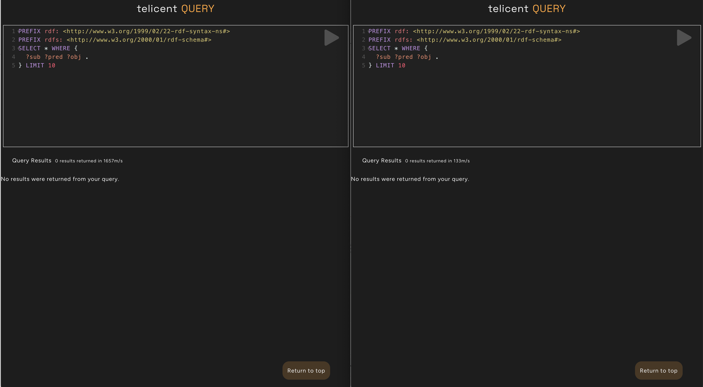
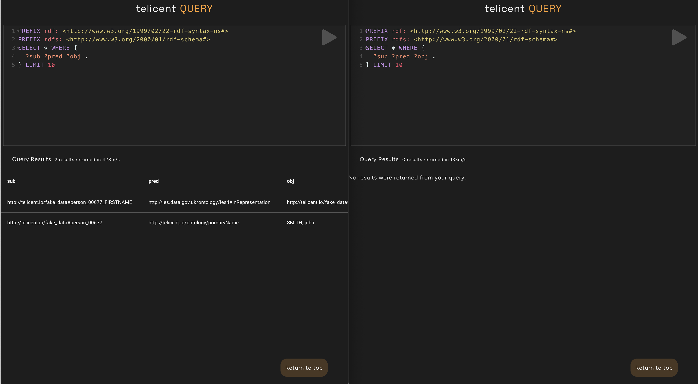
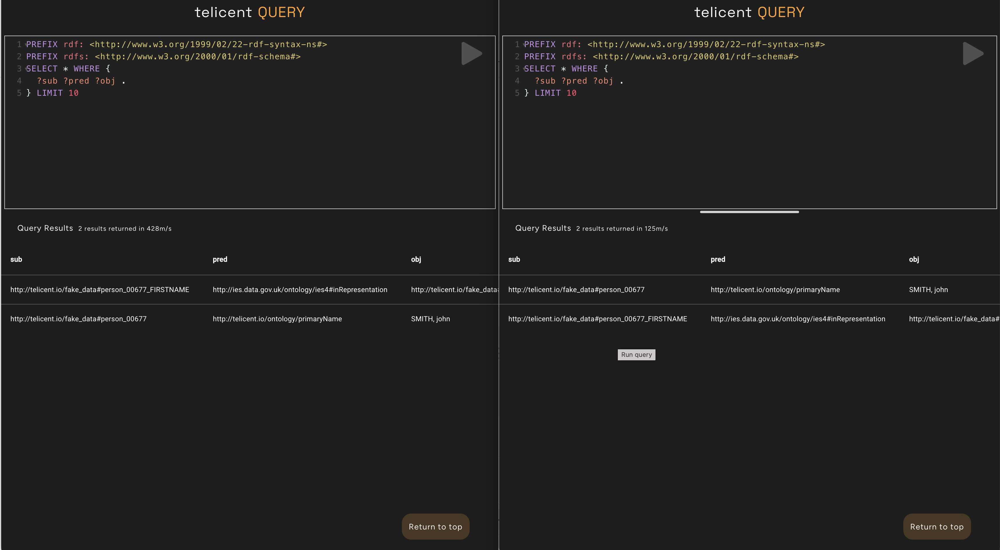

# Smoke test

This step adds a small amount of data to the server system and then walks
through querying the server and client instances. These instructions assume
there is no data in either deployment.

## Query the data in both systems (before)

Log in to the query interface of both server and client. Run the default query
on both. The image below shows the server on the left and client on the right.



Note that there are no results returned on either.

## Add the test data to the server

The data is added by a Kubernetes job that injects knowledge messages directly
into Kafka from a config map. Note this is not a recommended practice but
sufficient to prove the system.

### Adjust the Kafka brokers value

[Source](../../utils/smoke-test/kustomization.yaml)

Update the patch to the appropriate value for the server

### Review and apply resources to the cluster

Review the resources that will be created:

```
kubectl kustomize utils/smoke-test
```

Create the smoke test job on the server:

```
kubectl --context <SERVER CONTEXT> apply -k utils/smoke-test
```

### Check deployment status

Check the status of the job

```
$ kubectl --context <SERVER CONTEXT> get job,pod -n default
NAME                       COMPLETIONS   DURATION   AGE
job.batch/load-test-data   1/1           5s         15s

NAME                       READY   STATUS      RESTARTS   AGE
pod/load-test-data-8d8qt   0/1     Completed   0          15s
```

Inspect the logs to see if SCG ingested the data. Look for a line similar to:

```
11:30:46 INFO  FusekiKafka     :: [knowledge] Batch: Start offset = 0 ; Count = 1 : Payload = 262 bytes
11:30:46 INFO  FusekiKafka     :: [knowledge] Batch: Finished [0, 1] in 0.257 seconds
```

### Remove the job and config map

The job (but not the data in Kafka) can be removed like so:

```
kubectl --context <SERVER CONTEXT> delete -k utils/smoke-test
```

## Query the data in both systems (after)

Log in to the query interface of both server and client. Run the default query.

If timed correctly you will see data on the server (left of picture) and no data
on the client (right of picture).



Shortly after adding the test data you will see it on both the server (left of
picture) and client (right of picture).


