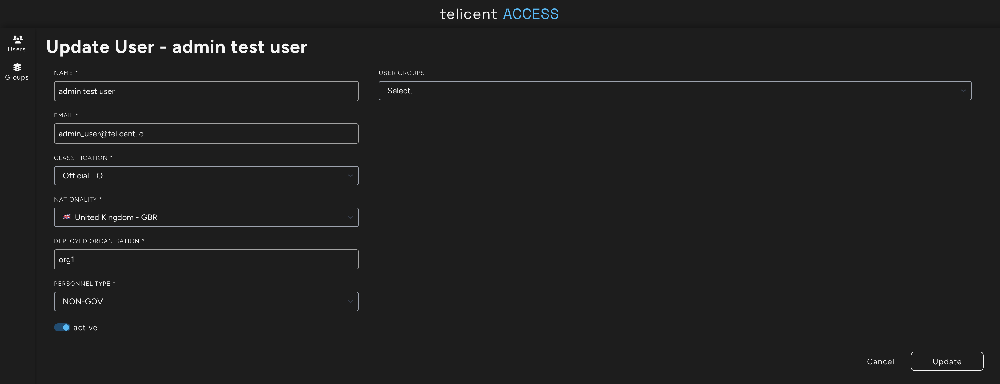

# Smoke test

This step adds a small amount of data to the server system and then walks
through querying the server and client instances. These instructions assume
there is no data in either deployment.

## Test data

### Message structure

_Note: a full explanation of the Telicent Kafka message structure and how to_
_generate appropriate security label and policy information headers is beyond the_
_scope of this guide._

Each line of test data consists of a Kafka message consisting of a set of
headers and a payload separated by a tab character. The payload is an RDF
triple:

```
<http://telicent.io/fake_data#person_00677> <http://telicent.io/ontology/primaryName> "SMITH, john" .
```

There are three headers separated by `;`.

`Content-Type` indicates the type of content in the body: 

```
Content-Type:application/n-triples
```

`Security-Label` is used internally by the smart caches to make access control decisions:

```
Security-Label:(classification=O&(permitted_organisations=org1)&(permitted_nationalities=GBR))
```

`policyInformation` is used by the federation components to manage flow of data
from one system to another (note the header has been pretty printed below).

```
policyInformation: {
  "IDH": {
    "apiVersion": "v1alpha",
    "uuid": "7d930967-3595-4b6a-bbec-853b981f380f",
    "creationDate": "2024-10-11T13:10:34.063235+00:00",
    "containsPii": true,
    "dataSource": "test_data",
    "access": {
      "classification": "O",
      "allowedOrgs": [
        "org1"
      ],
      "allowedNats": [
        "GBR"
      ],
      "groups": []
    },
    "ownership": {
      "originatingOrg": "org1"
    }
  }
}
```

### Test data content

The test data consists of three messages:

1. A message that is shareable between `org1` and `org2`
2. A message that is only allowed in `org1`
3. A message with an invalid `policyInformationHeader`

## Set up Access on client and server systems

On the server deployment ensure the test user has an organisation of `org1`:



On the client deployment ensure the test user has an organisation of `org2`:


## Query the data in both systems (before)

Log in to the query interface of both server and client. Run the default query
on both. The image below shows the server on the left and client on the right.


Note that there are no results returned on either.

## Add the test data to the server

The data is added by a Kubernetes job that injects knowledge messages directly
into Kafka from a config map. Note this is not a recommended practice but
sufficient to prove the system.

### Adjust the Kafka brokers value

[Source](../../utils/smoke-test/federation/kustomization.yaml)

Update the patch to the appropriate value for the server

### Review and apply resources to the cluster

Review the resources that will be created:

```
kubectl kustomize utils/smoke-test/federation
```

Create the smoke test job on the server:

```
kubectl --context <SERVER CONTEXT> apply -k utils/smoke-test/federation
```

### Check deployment status

Check the status of the job

```
$ kubectl --context <SERVER CONTEXT> get job,pod -n default
NAME                       COMPLETIONS   DURATION   AGE
job.batch/load-federation-test-data   1/1           5s         15s

NAME                       READY   STATUS      RESTARTS   AGE
pod/load-federation-test-data-8d8qt   0/1     Completed   0          15s
```

Inspect the logs to see if SCG ingested the data. Look for a line similar to:

```
11:30:46 INFO  FusekiKafka     :: [knowledge] Batch: Start offset = 0 ; Count = 1 : Payload = 262 bytes
11:30:46 INFO  FusekiKafka     :: [knowledge] Batch: Finished [0, 1] in 0.257 seconds
```

### Remove the job and config map

The job (but not the data in Kafka) can be removed like so:

```
kubectl --context <SERVER CONTEXT> delete -k utils/smoke-test/federation
```

## Query the data in both systems (after)

### Server

Log into the query interface on the server side. Running the default query you
will see the three test values.


If you are able to inspect the the Kafka topics [^1] then you will see:

1. All three messages on the `knowledge` topic
2. The message permitted to go to `org2` on the `knowledge-filtered` topic
3. The message with the broken `policyInformation` header on the `knowledge-filtered-dlq`


### Client

Log into the query interface on the client side. Running the default query you
will see the one test value.


If you are able to inspect the the Kafka topics [^1] then you will see:

1. The message permitted to go to `org2` on the `federated-knowledge-filtered` topic
2. The message permitted to go to `org2` on the `knowledge` topic


[^1]: The mechanism to inspect Kafka is beyond the scope of this guide.
